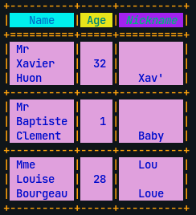
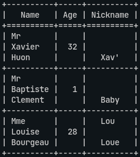
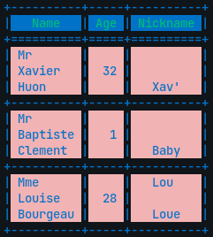
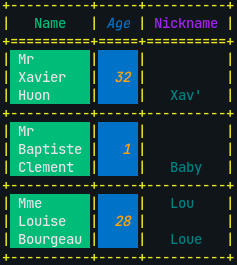

# blessedtable

Python module for creating colorful formatted ASCII tables.



## Dependencies

This package combines the [__texttable__](https://github.com/foutaise/texttable) and the [__blessed__](https://github.com/jquast/blessed) package; and thus, __blessedtable__. 

## Installing the package

```
pip install blessedtable
```
## Getting started

Inializing the table with default parameters will print the a table without any formatting. To know more about structuring the ascii table follow this [link](https://github.com/foutaise/texttable)

```python
from blessedtable import Blessedtable

table = Blessedtable()
table.set_deco(15)
table.set_cols_align(["l", "r", "c"])
table.set_cols_valign(["t", "m", "b"])
table.add_rows([["Name", "Age", "Nickname"],
    ["Mr\nXavier\nHuon", 32, "Xav'"],
    ["Mr\nBaptiste\nClement", 1, "Baby"],
    ["Mme\nLouise\nBourgeau", 28, "Lou\n\nLoue"]])

print(table.draw())
```


For styleing `blessedtable` uses three parameters over `textable`. These are `border_format, header_format, and column_format`. 

__`border_format`__ needs to be either `None` , or of type `str`
__`header_format`__ needs to be either `None`, or of type `str`, or a `list` of strings
__`column_format`__ needs to be either `None`, or of type `str`, or a `list` of strings 

__Note:__ The strings should be formatting strings. Examples are given below.
```python
'normal_on_norma' # text and background both have default color
'red' # text color is red, background has default color
'red_on_white' # text color is red, background is white
'italic_red_on_blue' # text italic and red, and background is white
```
All the color options can be found [here](https://blessed.readthedocs.io/en/latest/colors.html). To know more about `blessed`'s formatting, follow this [link](https://blessed.readthedocs.io/en/latest/index.html)

The three parameters can be set either while initializing or using setters.

```python
table = Blessedtable(header_format='green_on_blue', border_format='blue', column_format='blue_on_rosybrown2')
#or
table = Blessedtable()
table.set_deco(15)
table.set_cols_align(["l", "r", "c"])
table.set_cols_valign(["t", "m", "b"])
table.add_rows([["Name", "Age", "Nickname"],
    ["Mr\nXavier\nHuon", 32, "Xav'"],
    ["Mr\nBaptiste\nClement", 1, "Baby"],
    ["Mme\nLouise\nBourgeau", 28, "Lou\n\nLoue"]])
table.header_format = 'green_on_blue'
table.border_format = 'blue'
table.column_format = 'blue_on_rosybrown2'

print(table.draw())
```


To achieve different colors for the columns for both header and the rows, pass a list having format string for each of the columns.

__Note:__ The number of elements in the list should be equal to the number of columns in a row; each element (format string) correspomds to successive columns. If `header_format` is `None` then it inherits the `column_format` and vice versa. If you don't want it to inherit the styles, set the `header_format` or `column_format` to `"normal_on_normal"` 

```python
hf = ['green', 'italic_blue', 'purple']
cf = ['white_on_green', 'italic_orange_on_blue', 'teal']
table.header_format = hf
table.border_format = 'yellow'
table.column_format = cf

print(table.draw())
```
